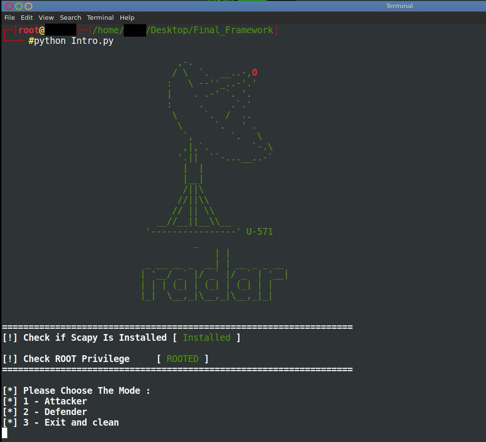
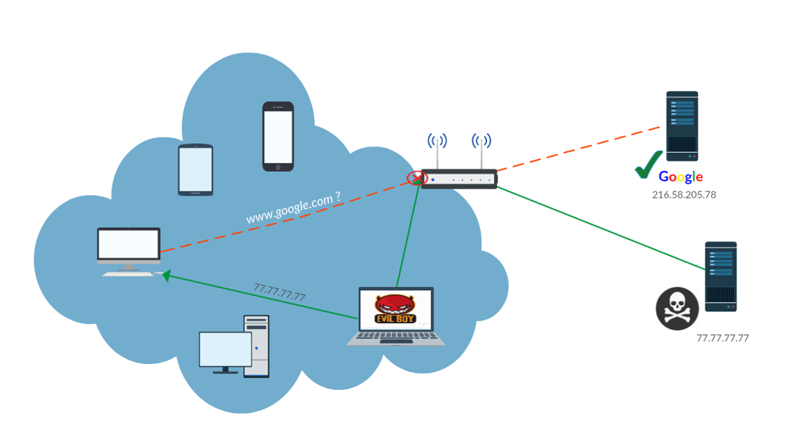
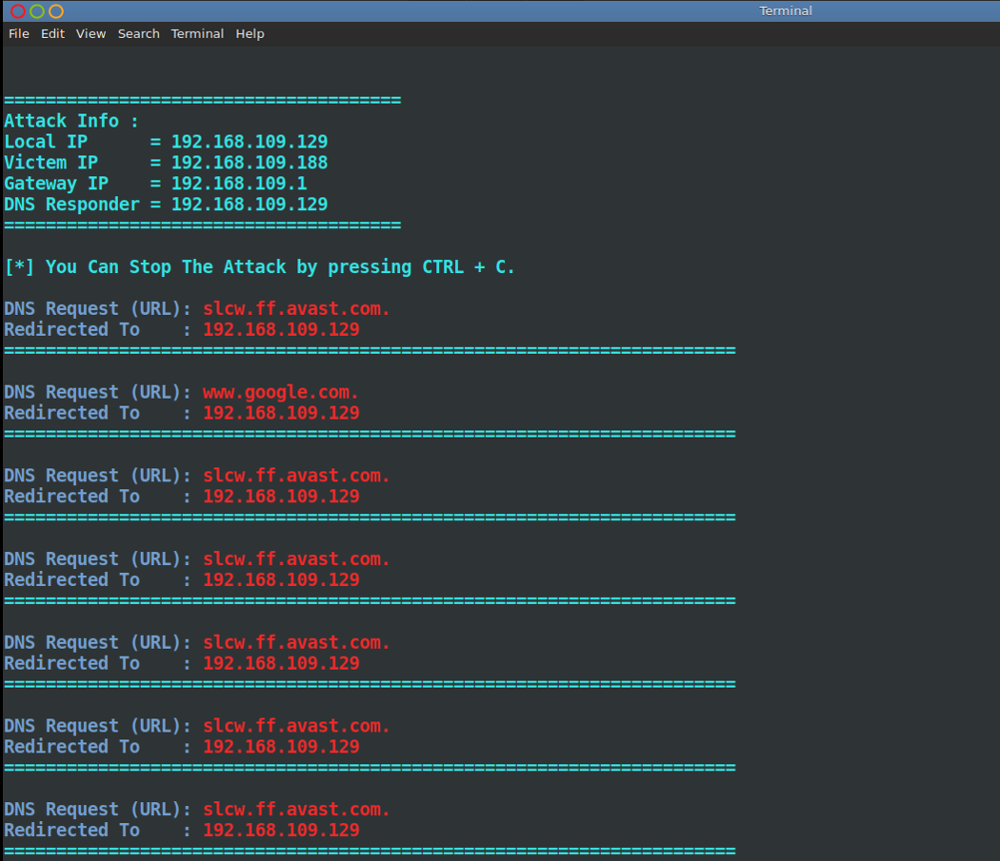
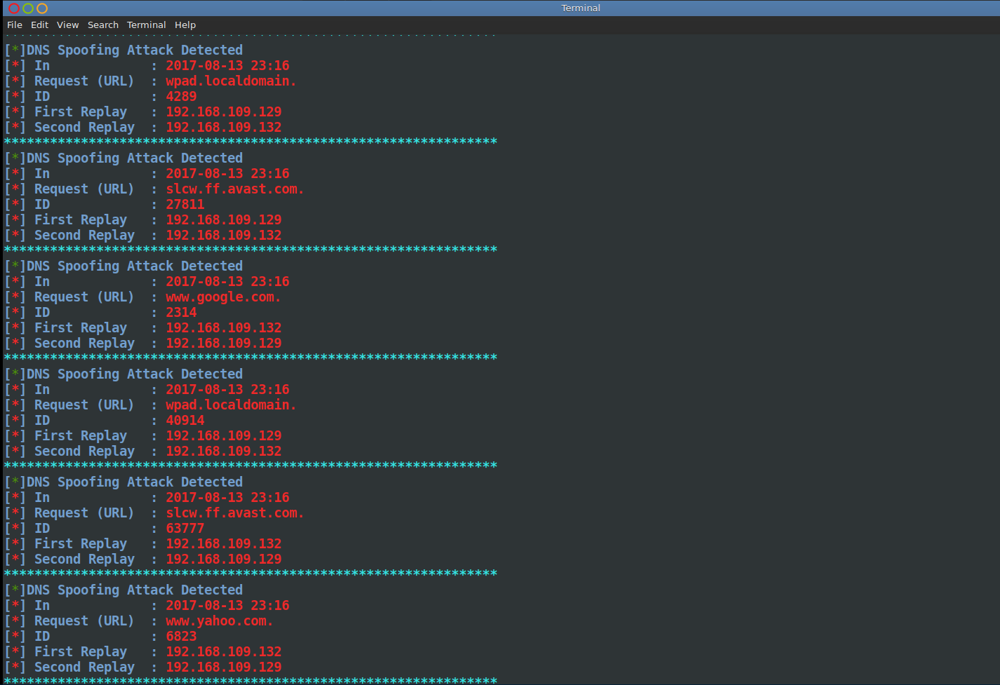
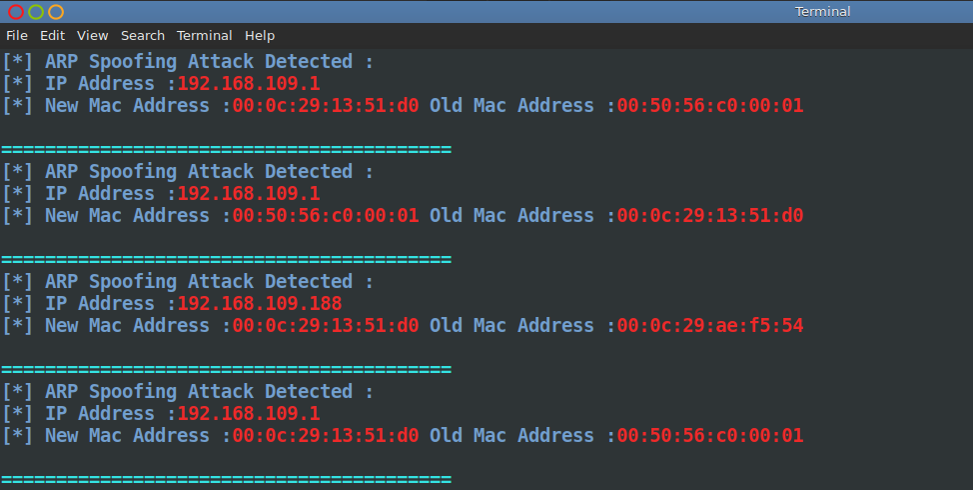
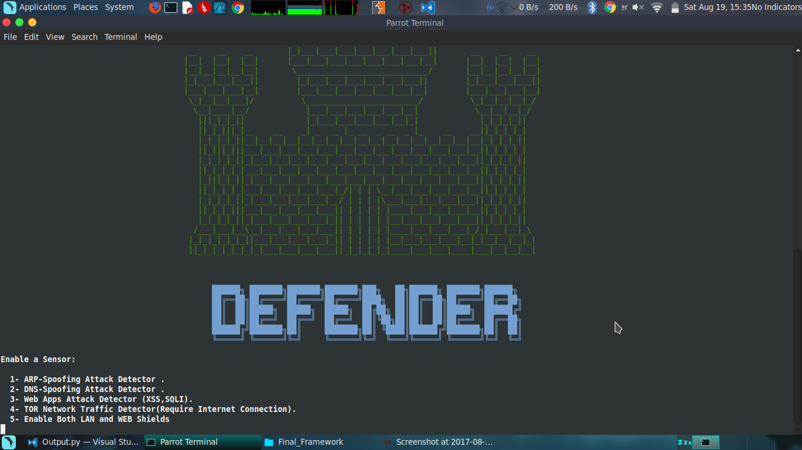
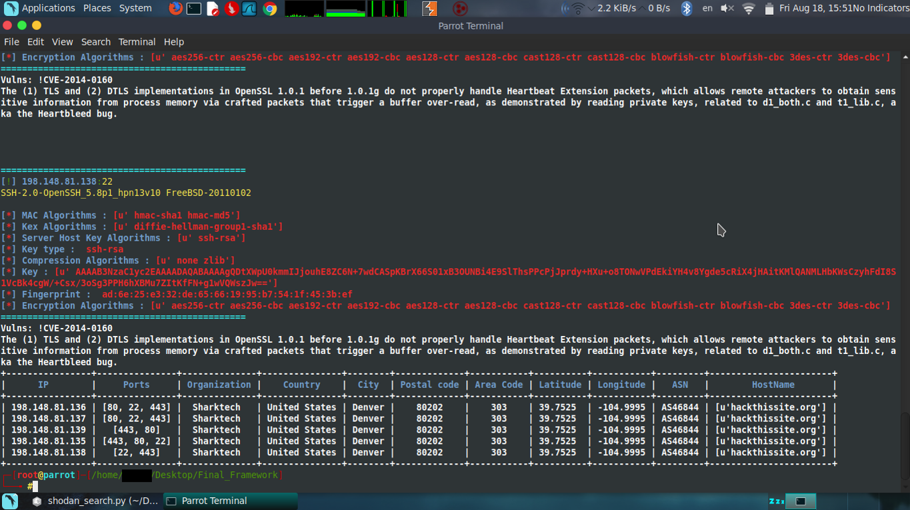
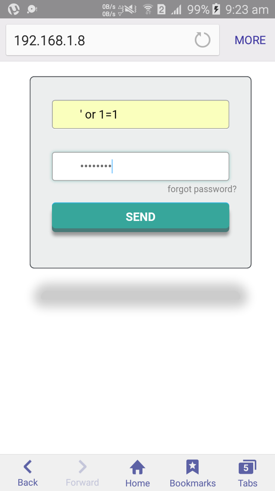
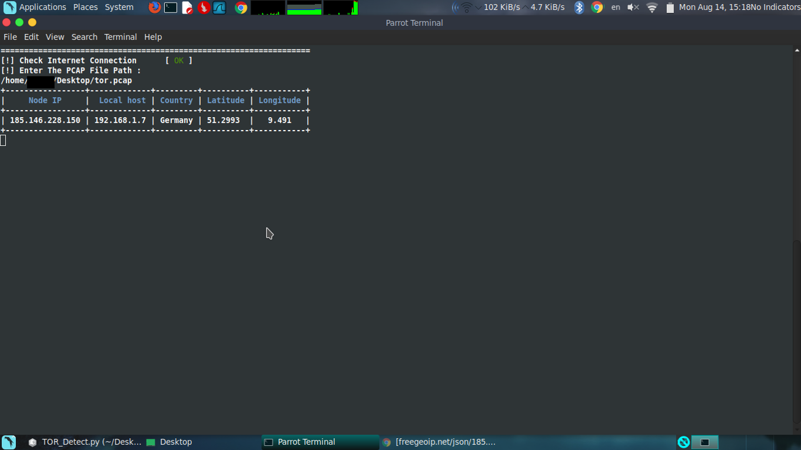

# Radar
Lightweight Network Intrusion detection system based on scapy library (Fourth year Project) 

Published at Hakin9 Magazine ("Build your own NIDS with scapy") :

https://hakin9.org/download/reverse-engineering-and-password-breaking/

